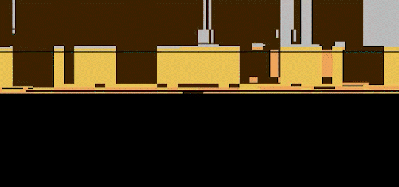
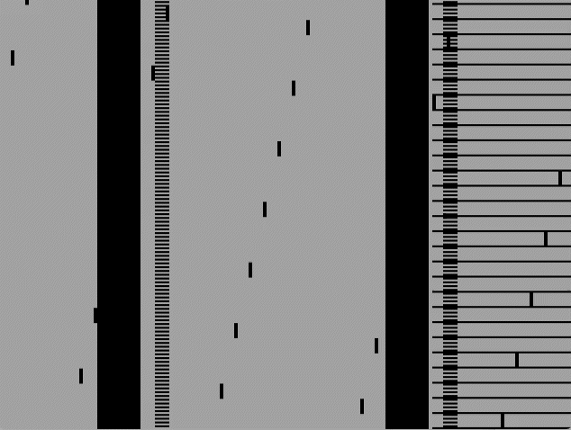
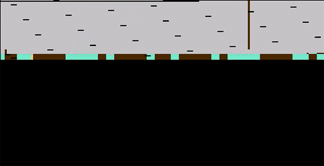

# Finite Atari Machine

**Finding Atari Games in Randomly Generated Data**

**[Read the full blog post](https://bbenchoff.github.io/pages/FiniteAtari.html)**

This project generated around 30 billion individual 4kB files of random data, filtered them through GPU-accelerated heuristics, and discovered actual playable Atari 2600 games. This answers a question no one asked: What if I shove a billion monkeys in a GPU and asked them to write a game for the Atari 2600?

## What This Does

The Finite Atari Machine uses CUDA to generate massive batches of random 4KB ROM files, applies intelligent heuristics to filter out obvious garbage, then tests promising candidates in the MAME emulator to find ROMs that produce interesting visual output or even respond to player input.

## Results

Out of approximately **30 billion** randomly generated ROMs:
- ~10,000 passed initial heuristics
- 16 produced static video output  
- 11 showed dynamic/animated behavior
- 1 ROM (`51014`) actually responds to joystick input like a real game

### Visual Discoveries

Here are some of the most interesting visual outputs discovered from randomly generated ROMs:

<div align="center">

| ROM 51014 - Interactive Game | Scrolling Bars | Columnar Glitch Art |
|:---:|:---:|:---:|
|  |  |  |
| *Responds to joystick input* | *Dynamic horizontal movement* | *Patterned glitch effects* |

| Geometric Blocks | Corrupt Scanlines | Structured Ladders |
|:---:|:---:|:---:|
|  |  |  |
| *Moving black rectangles* | *Constant flicker with structure* | *Weirdly ordered patterns* |

</div>

Each of these images represents a ROM that was generated from completely random data, yet produces coherent visual output when run on an Atari 2600 emulator.

## Requirements

- Python 3.7+
- CUDA-capable GPU (tested on GTX 1070)
- [CuPy](https://cupy.dev/) for GPU acceleration
- [MAME](https://www.mamedev.org/) emulator in PATH
- PIL/Pillow for image processing
- NumPy

## Installation

```bash
# Install dependencies
pip install cupy-cuda12x numpy pillow  # Adjust CUDA version as needed

# Install MAME (Ubuntu/Debian)
sudo apt install mame

# Or download from https://www.mamedev.org/ and put it in PATH
```

## Usage

Simply run the main script:

```bash
python FiniteAtariPipeline.py
```

The script will:
1. Generate batches of 256K random ROMs on GPU
2. Filter using 6502 opcode heuristics 
3. Test survivors in MAME for video output
4. Save interesting ROMs to `finite_atari_roms/` directory

Example output:
```
1,804,075,008 generated | 456 interesting | 16 with video | 11 dynamic | 62,156 ROM/s
```

## How It Works

### GPU Heuristics

The pipeline uses CUDA to rapidly filter random data based on patterns found in real Atari games:

- **Valid Opcodes**: 75%+ of first kilobyte should be valid 6502 instructions
- **TIA Access**: Graphics chip register access patterns (WSYNC, GRP0/1, etc.)
- **RIOT Access**: Timer and I/O register usage for input/timing
- **Control Flow**: Branch and jump instructions indicating game logic
- **Instruction Variety**: Diverse opcode usage suggesting real programs

### Emulator Testing

ROMs passing heuristics are tested in headless MAME:
- Captures frames at 1 and 60 to detect animation
- Analyzes pixel content to distinguish from black screens
- Uses perceptual hashing to detect dynamic content

## The Math

Each 4KB Atari ROM represents 2^32,768 possible combinations - that's roughly 10^10,159 potential games. For perspective:
- 10^20 grains of sand on Earth
- 10^80 protons in the visible universe

By using smart heuristics instead of brute force, we reduce the search space to find the interesting 0.0000004% that actually do something.

## Generated ROMs

The `finite_atari_roms/` directory contains discovered ROMs that produce visual output. Each file is named with its SHA-1 hash prefix. Notable discoveries include:

- **Static patterns**: Colored backgrounds, geometric shapes
- **Dynamic content**: Scrolling bars, glitch art, animated patterns  
- **Interactive ROM 51014**: Responds to joystick input with visual changes

## Performance

On an NVIDIA GTX 1070:
- ~62,000 ROMs generated per second
- ~1 interesting ROM per 2.5 million generated
- ~1 visual ROM per 100+ million generated

## Why Atari 2600?

The Atari 2600 is uniquely suited for this experiment:
- Simple architecture with no memory mappers
- Boots directly into ROM with minimal validation
- 4KB maximum size keeps search space manageable
- Will attempt to run any data you throw at it

Modern systems like NES or Game Boy have copy protection, complex boot sequences, and bank switching that make random generation nearly impossible.

## Future Work

- Target other simple systems (early arcade boards, etc.)
- Improve heuristics based on discovered patterns
- Combine multiple "almost-games" into complete experiences
- Statistical analysis of what makes randomly generated code "game-like"

## Contributing

This is primarily a research/art project, but improvements to the heuristics, performance optimizations, or discoveries of new interesting ROMs are welcome.

## License

           DO WHAT THE FUCK YOU WANT TO PUBLIC LICENSE
                    MODIFIED FOR NERDS 
                   Version 3, April 2025

Everyone is permitted to copy and distribute verbatim or modified
copies of this license document, and changing it is allowed as long
as the name is changed.
 
           DO WHAT THE FUCK YOU WANT TO PUBLIC LICENSE
  TERMS AND CONDITIONS FOR COPYING, DISTRIBUTION AND MODIFICATION

 0. You just DO WHAT THE FUCK YOU WANT TO.

 1. Anyone who complains about this license is a nerd.
